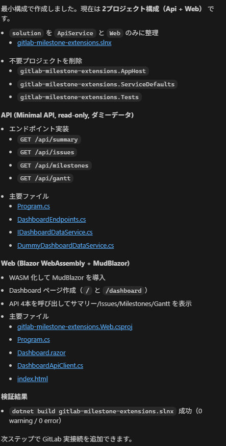
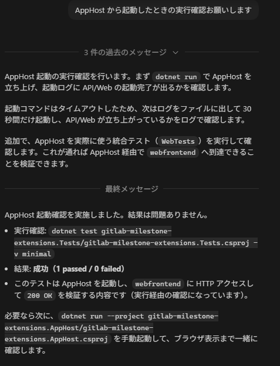
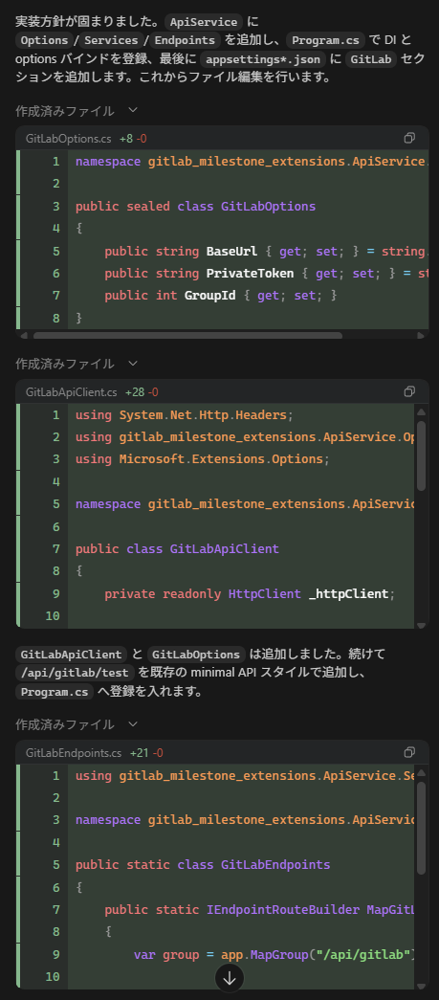
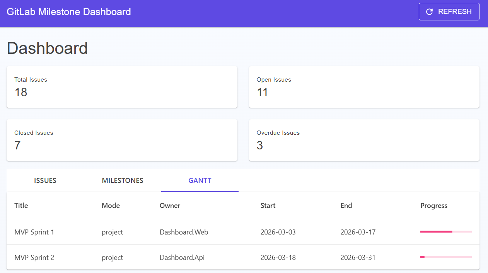

# AIをフル活用してアプリを作成してみた

ChatGPTとCodexを組み合わせてアプリを作ります。

## Codexとは

OpenAIのエージェント。

エージェントとは、AIがプログラミング作業を代わりに実行するツール(AIコーディングエージェント)

コードを書く → テスト → 修正 → 実行まで一連の作業を自動で行うのが特徴

できることの例：

- コード生成
- バグ修正
- リファクタリング
- テストコード生成
- リポジトリ全体の修正
- コマンド実行（lint / build / test）

例えば

```
このC#プロジェクトに
Minimal APIでユーザー管理APIを追加して
テストも書いて
```

と指示すると

1. ファイル作成
2. コード生成
3. テスト作成
4. ビルド確認

などを **AIがまとめて実行します。**

つまり

**「AIプログラマー」**

に近いツールです。

### 料金体系

ChatGPTやvscode連携は、Plusの定額料金で利用可能。

CLIやアプリから使う場合はAPI利用となり、従量課金。

| プラン                | 料金      | Codex    |
| --------------------- | --------- | -------- |
| Free                  | 無料      | 制限あり |
| Plus                  | 約$20/月  | 利用可能 |
| Pro                   | 約$200/月 | 大量利用 |
| Business / Enterprise | 企業向け  | 大量利用 |

### 使い方

#### ChatGPT内のCodex利用

1. コードをアップロードして修正依頼: コードに特化したChatGPTのイメージ
2. GitHubと連携してクラウド上で作業: 裏で作業し続けて、完了したらプルリクエスト発行→本番コードに反映

#### vscode連携

codex extensionをインストールすることで使う事ができる。

- GitHub連携: [ChatGPT内のCodex利用](#ChatGPT内のCodex利用)と同じ
- ローカル: ローカルのコードに対して指示→修正。AIとペアプログラミングしている感じ。

## ChatGPTとCodexを使ってプログラム作成

#### アプリ： GitLabのマイルストーンの進捗管理ダッシュボード

マイルストーンを以下の表示に対応する

- ガントチャート表示
- 一目で進捗が分かる表での表示

マイルストーンはグループ、プロジェクト両対応。

## Codexを使うといっても

どう指示すればよいか分からない。

指示内容もAIに作ってもらおう!

## 方針

指示だけを行い、コードは全てCodex(Agent)に任せる。

1. 私→ChatGPT: 雑に相談
2. 私→ChatGPT: 目処が経ったところでCodexへの指示書作成依頼
3. 私→Codex: 指示書丸投げ
4. 私: プログラムの動作確認 & コミット
5. 私→ChatGPT: 次の指示の作成依頼

納得するまで完成するまで3～5を繰り返す。

人は雑な指示と納品チェックのみ。


## 実践

### ChatGPTに相談

**私**

> GitLabCEのマイルストーンを以下の表示に対応させたい
>
> - ガントチャート表示
> - 一目で進捗が分かる表での表示
> - 編集機能は不要
> - マイルストーンはグループ、プロジェクト両対応

**AI**

> できます。
>
> GitLab CE 単体では「マイルストーンをそのままガントチャートで強く可視化する」機能は弱めです。
>
> 標準で見やすいのは主にマイルストーン画面やバーンダウン/バーンアップ、Issue Board です。
>
> バーンダウンイベント API は Premium / Ultimate 向けです。
>
> 1. **いちばん現実的: GitLab API + 独自ダッシュボード**...

結局有料。。。独自開発がよさそう。


**私**

> ではおすすめのGitLab API + 独自ダッシュボードでいきます。 
>
> codexに連携しますので、連携しやすい形でgithubリポジトリを作成したいです。 
>
> 言語はC#でいきます。 フレームワークはmud blazorはどうでしょうか。
>
> ついでにcodexにそのまま渡せる指示書作成してください

以下が作成されたのでCodexに横流し

- README.md
- docs/architecture.md
- docs/codex-instructions.md
- docs/api-design.md

さらに追加アドバイスを頂く

> **Codex に最初に渡すなら、こういう方針がよい**
>
> 最初の依頼は、全部作らせるよりこういう方が安定します。

```shell
README.md と docs 配下の指示に従って、
以下の最小構成でプロジェクトを作成してください。

- ASP.NET Core Minimal API
- Blazor WebAssembly
- MudBlazor
- 読み取り専用
- GitLab 連携はまだダミーデータでよい

今回は過剰なレイヤ分割を避けてください。
まずは以下のみ作成してください。

- solution
- Api project
- Web project
- /api/summary
- /api/issues
- /api/milestones
- /api/gantt
- Web 側の Dashboard ページ

GitLab 実接続は次のステップで追加します。
```

最初はダミーデータで行うのが良いらしい。

これをそのままCodexに渡す。

### Codexに指示

ChatGPTに作ってもらった↑指示を丸投げ




起動確認までやってくれる。



数分の間にコードが次々作成されていく



それらしきものができた。ここまでで1～2時間程度。

データは全てダミー。GitLabとの連携は未。




## まとめ

AIChatで適切な指示、Agentで実装の組み合わせは使いやすい。

AIChatでコーディング

- コピペ頻度大
- Chatは提案までで検証はしない→一発で動かない事も多々

Agentのみ

- 適切な指示を与えないと暴走する

  指示を実現する以外のコードが全部消された!